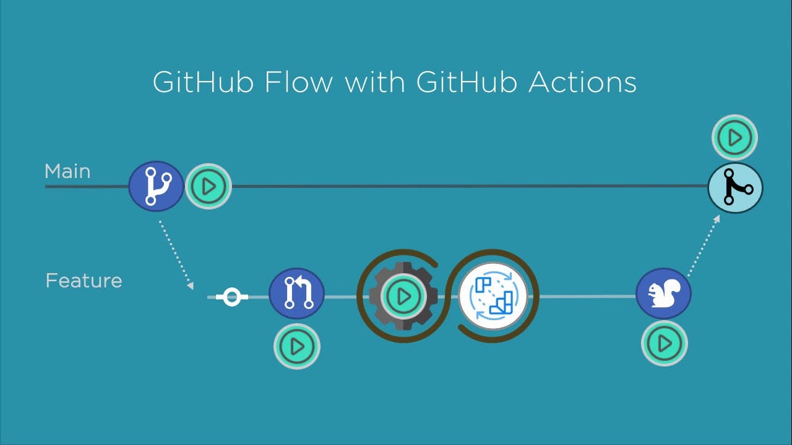

# My-Project-Github-Action-CICD
<h1 align="center">Bài tập thực hành Github action CI/CD </h1>

<h1 align="center">Hi 👋, I'm Vo Nguyen Thanh Tu</h1>

- ✍ I'm a student of: [Industrial University of Ho Chi Minh City](https://iuh.edu.vn/).
- ✍ Subject : Softwware Engineer
- ✍ Content: Thực hành về Github action CI/CD

 

# 📒Hoạt độnng:
<table style="width:100%;">
  <tr>
    <td>
      
      
    </td>
    <td>
      
 
        
      

    </td>
  </tr>
</table>

# 📒Kĩ năng áp dụng trong Project :

  
  
  

# 📒Yêu cầu Project :

  Biết được cách sử dụng tool CI/CD như Github Action.

# 😍Trình bày về project:

  Sơ đồ mô phỏng về quá trình:

  - Flow thực hiện quá trình CI/CD một cách tự động từ build code, tự động hóa, deploy

